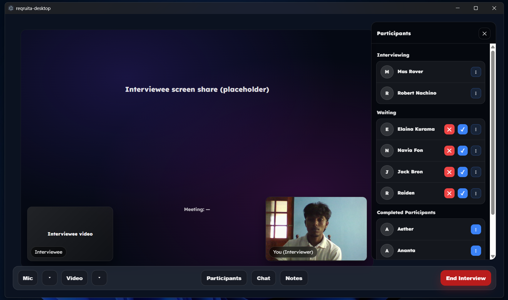
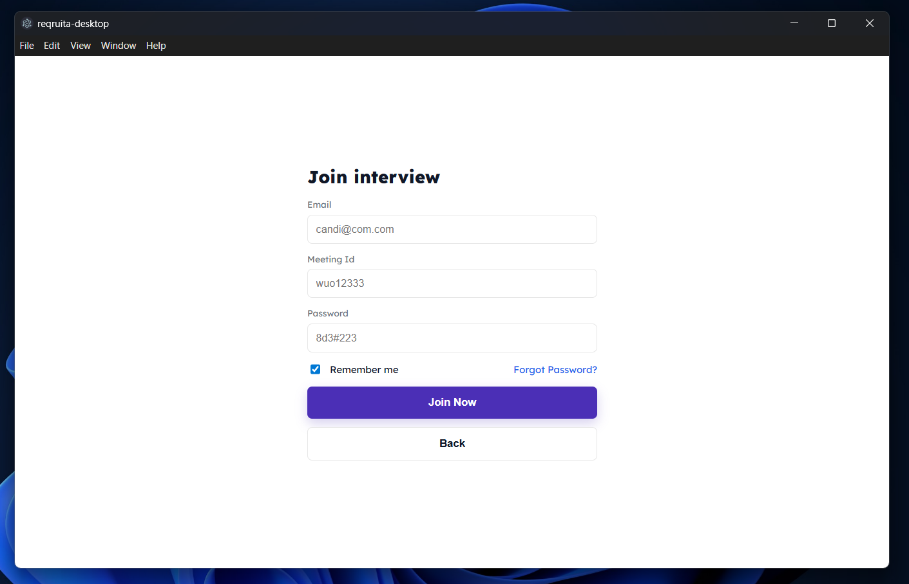

<!-- ====== HERO ====== -->
<h1 align="center">Reqruita Desktop 🧠💼 </h1>

<p align="center">
  
</p>

<p align="center">
  <b>Distraction-free technical interviews</b> built as a dedicated desktop experience.
</p>

<p align="center">
  
  
  
</p>

<!-- ====== BADGES ====== -->
<p align="center">
  
  
  
  
  
</p>

<p align="center">
  <a href="#-features">Features</a> •
  <a href="#-screens">Screens</a> •
  <a href="#-run-locally">Run</a> •
  <a href="#-roadmap">Roadmap</a>
</p>

---


## ⚡ What’s inside

<table>
<tr>
<td width="33%">

### 🧑‍💼 Admin

<p>
Owns the system.<br/>
Manages access, roles, and interview structure.<br/>
Sets the rules before interviews ever start.
</p>

</td>
<td width="33%">

### 🎙️ Interviewer

<p>
Runs the interview.<br/>
Screen-first view with supporting context.<br/>
Notes, chat, and participants — without clutter.
</p>

</td>
<td width="33%">

### 👨‍💻 Interviewee

<p>
Joins a locked environment.<br/>
Fullscreen enforced.<br/>
Screen sharing required from entry to exit.
</p>

</td>
</tr>
</table>

---

<div align="center">

### 🔒 Entry gate
Microphone · Camera · Screen Share  
Validated before joining. No bypasses.

</div>

---

<div align="center">

### 🛡️ Anti-cheat approach
Not surveillance.<br/>
Structure first. Enforcement later.

</div>


---

## 🎬 Screens


<p align="center">
  
</p>

<p align="center">
  
</p>

<details>
  <summary><b>📸 More screenshots</b> (click)</summary>

  <br/>
  <p align="center">
    
  </p>

  <p align="center">
    
  </p>

  <p align="center">
    
  </p>
</details>

---

## 🧱 Tech

- **Electron** (desktop shell)
- **React + Vite** (UI)
- **WebRTC APIs** (`getUserMedia`, `getDisplayMedia`)
- **IPC Bridge** (preload → renderer)
- **Custom CSS** (design-system style)

---

## 🗂️ Structure

```bash
reqruita-desktop/
├─ electron/        
├─ src/            
├─ public/
└─ assets/          
